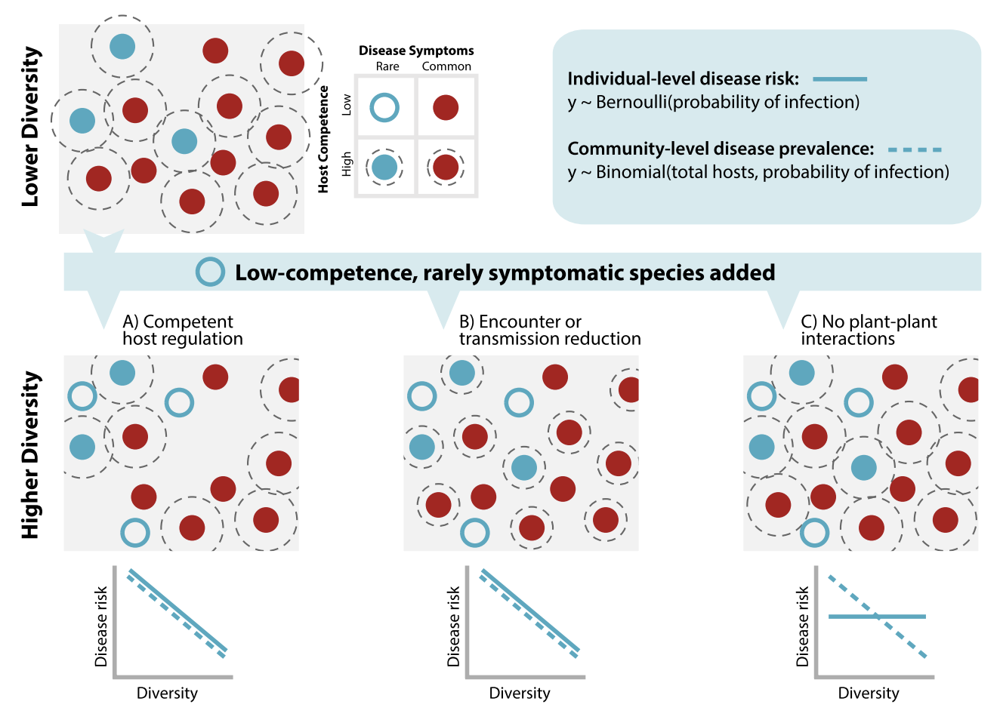
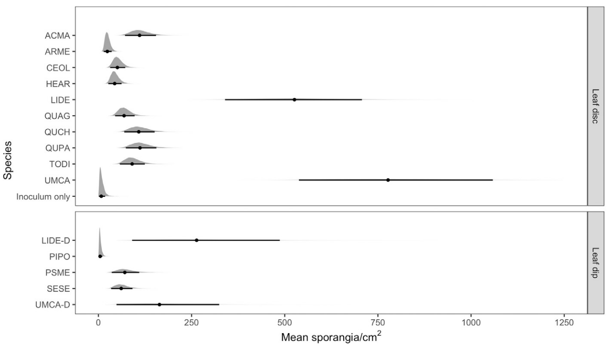
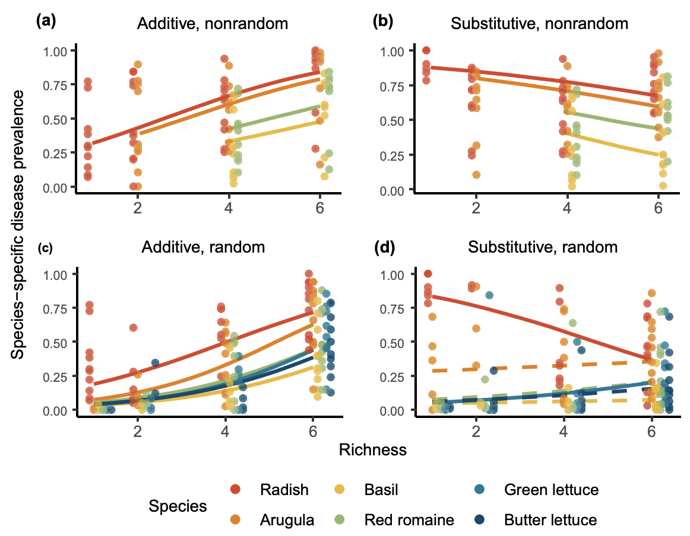

**Rosenthal, L.**, Simler-Williamson, A., Rizzo, D. “Community-level prevalence of a forest pathogen, not individual-level disease risk, declines with tree diversity”. *Ecology Letters*. 2021. 

- [paper](https://research.fs.usda.gov/treesearch/63123)
- [code](https://github.com/lisamr/Forest_div_dis_mechanisms)

{fig-align="center" width=50%}

While plant species richness decreased community-level prevalence of the forest disease sudden oak death, individual disease risk for species most susceptible remained the same or even increased. This study demonstrates that mechanisms driving disease risk are not conserved across hierarchical scales, and that statistical considerations can lead to misleading explanations of the diversity-disease relationship. 

---

**Rosenthal, L.**, Fajardo, S., Rizzo, D. "Sporulation Potential of Phytophthora ramorum Differs Among Common California Plant Species in the Big Sur Region". *Plant Disease*. 2021. 

- [paper](https://apsjournals.apsnet.org/doi/pdf/10.1094/PDIS-03-20-0485-RE)
- [code](https://github.com/lisamr/competency)

{fig-align="center" width=50%}

Sudden oak death (SOD), caused by the generalist pathogen Phytophthora ramorum, has profoundly impacted California coastal ecosystems. SOD has largely been treated as a two-host system, with remaining species as epidemiologically unimportant. We formally quantified the sporulation potential of common plant species inhabiting SOD-endemic ecosystems on the California coast in the Big Sur region. Data from this study was subsequently integrated into an analysis testing the mechanisms underlying the diversity-disease relationship (see above: Rosenthal et al., Ecology Letters 2021). 

---

**Rosenthal, L.**, Brooks, W., Rizzo, D. "Species densities, assembly order, and competence jointly determine the diversity–disease relationship" *Ecology*. 2022.

- [paper](https://esajournals.onlinelibrary.wiley.com/doi/pdf/10.1002/ecy.3622)
- [code](https://github.com/lisamr/mesocosm2021_public)

{fig-align="center" width=50%}

Since species vary in abundance and host competence (i.e., ability to get
infected and transmit a pathogen), changes in species composition caused by
biodiversity loss impacts disease dynamics. Forecasting effects of species composition on disease depends on community (dis)assembly, processes determining how species are added to (or lost from) communities. We simulated
community assembly by planting mesocosms, nested along a richness gradient, and tested how relationships between richness, species assembly order,
and overall density affect disease risk. 