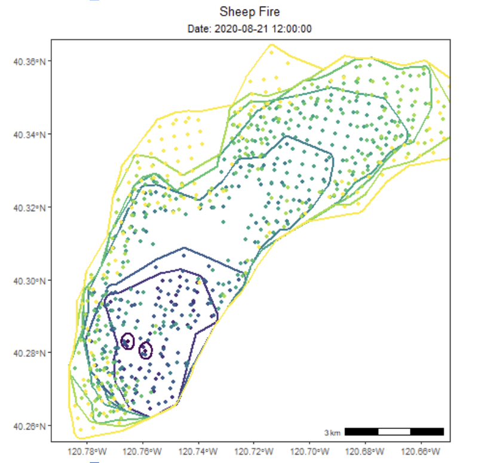

In my job at CARB, I developed a new pipeline to generate an inventory of daily wildfire emissions. Plans to release the documentation and code publicly are for Summer 2025. More to come on the emissions work.

In order to derive daily emissions estimates, I collaborated with NASA on an algorithm called "FEDS", the  Fire Events Data Suite (see [Chen et al. 2021](https://www.nature.com/articles/s41597-022-01343-0)). FEDS ingests VIIRS satellite active fire products, clusters the points with a machine learning algorithm, and interpolates sub-daily perimeters every 12 hours. While NASA is mainly addressing the need to monitor near-real time fire activity globally, I've worked with the team to improve the accuracy of retrospective, science-standard fire monitoring products.  

- [code](https://github.com/Earth-Information-System/fireatlas)

{fig-align="center" width=50%}
