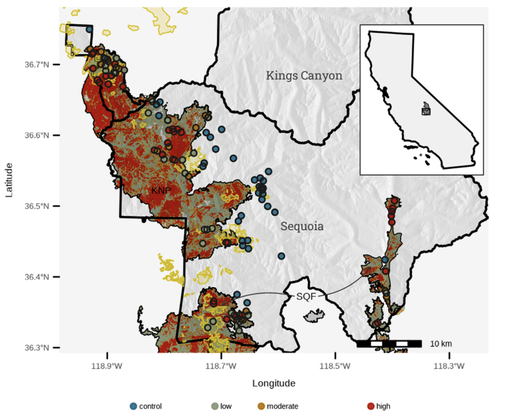
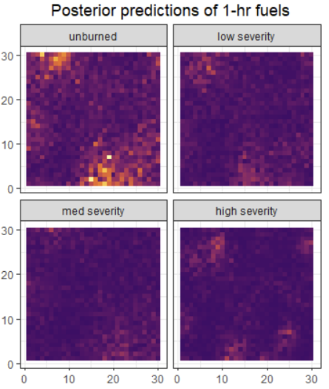
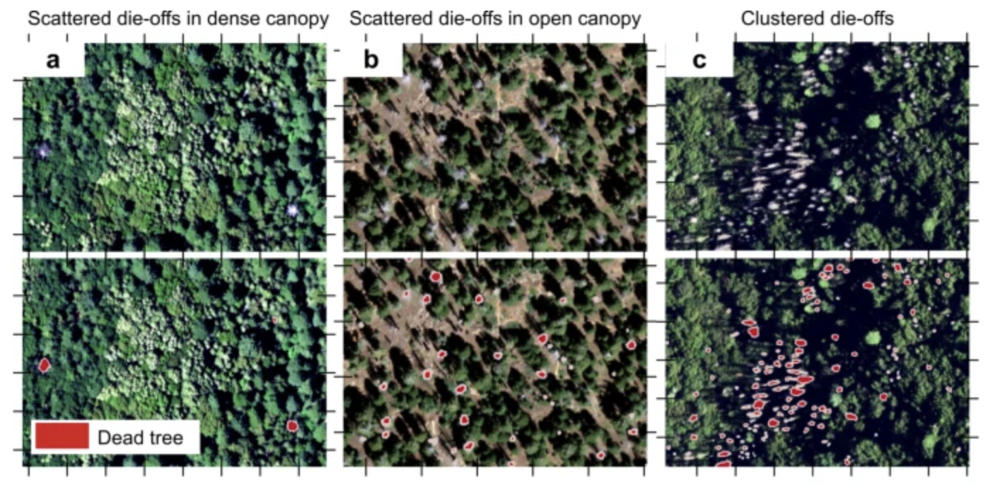

Das, A., **Rosenthal, L.**, Shive, K. "The effectiveness of wildfire at meeting restoration goals across a fire
severity gradient in the Sierra Nevada". *Forest Ecology & Management*. 2025. 

- [paper](https://www.sciencedirect.com/science/article/pii/S0378112724007989?casa_token=o_A9ipokntwAAAAA:UGw2r3s-HjY7kIRzImmkIzTj4PQmXu0hkdj4YfFPLVfrkfkH2FSfgnhDC87NCe7NfaypnGajxvo)

Analysis of wildfires in the southern Sierra Nevada quantifies post-fire fuel loading across a severity gradient and assesses the impact within the context of the National Park’s fuel management plan. Highlights include: 

- Fine fuels declined with severity, while coarse fuels were more variable
- Low and moderate severity wildfire effects align with short-term management goals
- Abundant standing fuels and lack of heterogeneity may reduce long-term resilience
- Large tree densities tended to fall below management targets even in control areas

{fig-align="center" width=50%}

---

This paper was just the tip of the iceberg in the fuels analysis that I conducted. The much larger goal was to examine fine-scale spatial heterogeneity of surface fuels. Ultimately, this work is needed to build fuel models at high spatial resolution for next-generation fire behavior models. I developed hierarchical Guassian Process models to statistically estimate the spatial turnover of various fuel components. I used K-fold cross-validation to test the predictive performance of the models, running multiple models in parallel on a high performance computing cluster. 

{fig-align="center" width=50%}

---

Cheng, Y., Oehmcke, S., Brandt, M., **Rosenthal, L.**, Das, A., Vrieling, A., Saatchi, S., Wagner, F., Mugabowindekwe, M., Verbruggen, W., Beier, C., Horion, S. "Scattered tree death contributes to substantial forest loss in California". *Nature Communications*. 2024. 

During my time at USGS, I also coauthored a publication focused on detecting tree mortality using high-resolution NAIP imagery with a deep learning model. Check it out here: 

- [paper](https://www.nature.com/articles/s41467-024-44991-z)

{fig-align="center" width=60%}