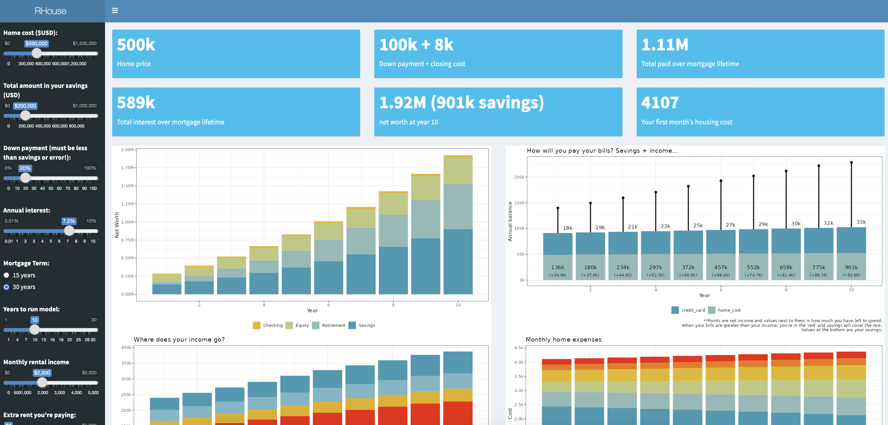

My husband and I bought a house and I was overwhelmed with all of the financial decisions that we needed to make. Instead of building an Excel model like a normal person, I decided to model various financial choices in R and made a [Shiny dashboard](https://rhouse.shinyapps.io/Rhouse_for_the_people/). Yeah...

Check it out and lmk if you actually found it useful!

{fig-align="center" width=70%}