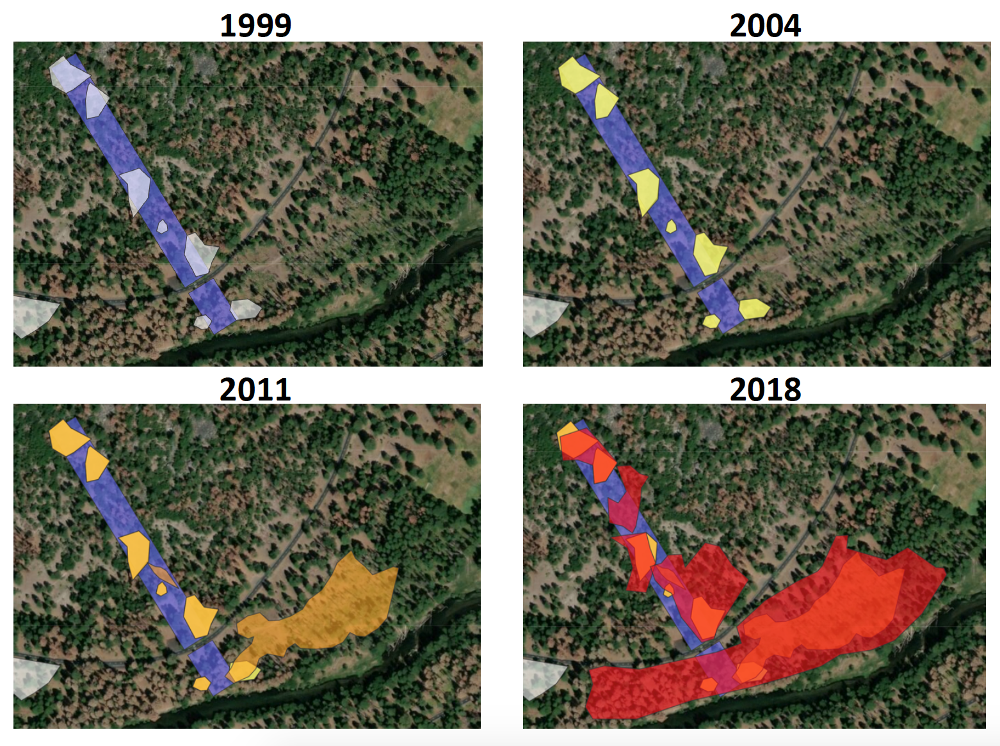
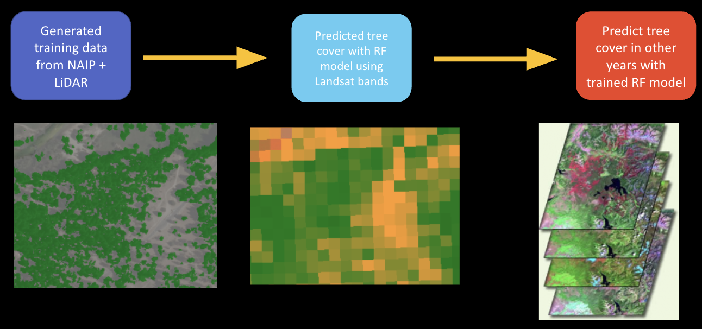

Unlike abiotic disturbances that cause discrete, non-expanding canopy gaps, biotic mortality agents can create gaps that continue to grow for many years (see sidebar for common agents). Yosemite Valley is an example of a natural landscape in the Sierra Nevada that has seen substantial growth in canopy gaps over the past several decades. In this study, I addressed the following questions:

1) How do gaps change in terms of i) area, ii) cause of gap formation, and iii) mortality?
2) How has live tree coverage changed over time?

We monitored canopy gaps in Yosemite Valley through repeated surveys of belt transects in 1999, 2004, 2011, and most recently in Fall 2018. 

{fig-align="center" width=50%}

Using Google Earth Engine, I also built a random forest model using lidar data, NAIP imagery, and Landsat data to estimate live tree coverage over the entirety of the Valley covering a 34-year timeframe.

{fig-align="center" width=70%}